# Advanced Lane Finding Project

The goals / steps of this project are the following:

* Compute the camera calibration matrix and distortion coefficients given a set of chessboard images.
* Apply a distortion correction to raw images.
* Use color transforms, gradients, etc., to create a thresholded binary image.
* Apply a perspective transform to rectify binary image ("birds-eye view").
* Detect lane pixels and fit to find the lane boundary.
* Determine the curvature of the lane and vehicle position with respect to center.
* Warp the detected lane boundaries back onto the original image.
* Output visual display of the lane boundaries and numerical estimation of lane curvature and vehicle position.

[//]: # (Image References)

[image1]: ./examples/undistort_output.png "Undistorted"
[image2]: ./test_images/test1.jpg "Road Transformed"
[image3]: ./examples/binary_combo_example.jpg "Binary Example"
[image4]: ./examples/warped_straight_lines.jpg "Warp Example"
[image5]: ./examples/color_fit_lines.jpg "Fit Visual"
[image6]: ./examples/example_output.jpg "Output"
[video1]: ./project_video.mp4 "Video"

--

### Writeup

#### 1. [Here]() is the writeup for project.

You're reading it!

- All the code is in Python notebook `P4_Advanced_Lane_Detection.ipynb`

### 1. Camera Calibration
The first steps to identify lane detection is to perform Camera calibration. This helps in un-distorting the image from a distorted camera. 

#### How to calibrate an Camera:
OpenCV provides and API to calibrate a Camera.

`cal_dict = calibrate_camera(objpoints, imgpoints, cal_image)`

- It requires object points and image points and an image for calibration. 

Thus, the goal of finding `objpoints ` and `imgpoints ` is implemented in 2 sections of the python notebook. 
 
- ( `#1.-Find-corners-of-Chessboard`) 
- (` #2.-Calibrate-and-UnDistort-image`) 

The basic idea is to first find the corner points of Chessboard and use that to calibrate the camera. 

### 1.1. Find image and object points

- The first step is to create the objects points `objpoints`. This is created using `numpy` and size of the array is `row=9` and `col=6`. This is a 3-D array, which consists of points of a correct chessboards in the real world. Here, the z-axis is `Zero`, since all the points lies flat on z-axis. - Sample data for `objpoints` for the first coloumn is shown below. 

```
	   [ 0.,  0.,  0.],
       [ 1.,  0.,  0.],
       [ 2.,  0.,  0.],
       [ 3.,  0.,  0.],
       [ 4.,  0.,  0.],
       [ 5.,  0.,  0.],
       [ 6.,  0.,  0.],
       [ 7.,  0.,  0.],
       [ 8.,  0.,  0.],
```

- This array is used whenever I sucessfully find the corners of chessboards using the function `findChessboardCorners`
- The `findChessboardCorners` functions retruns me the corners found in the image. These image points are appended in the array `imgpoints`

### Plotting the corners found: 
- For debugging, I plotted the corners found by the function `findChessboardCorners`. Some samples are:

|      		|     	        			| 
|:---------------------:|:---------------------------------------------:| 
| 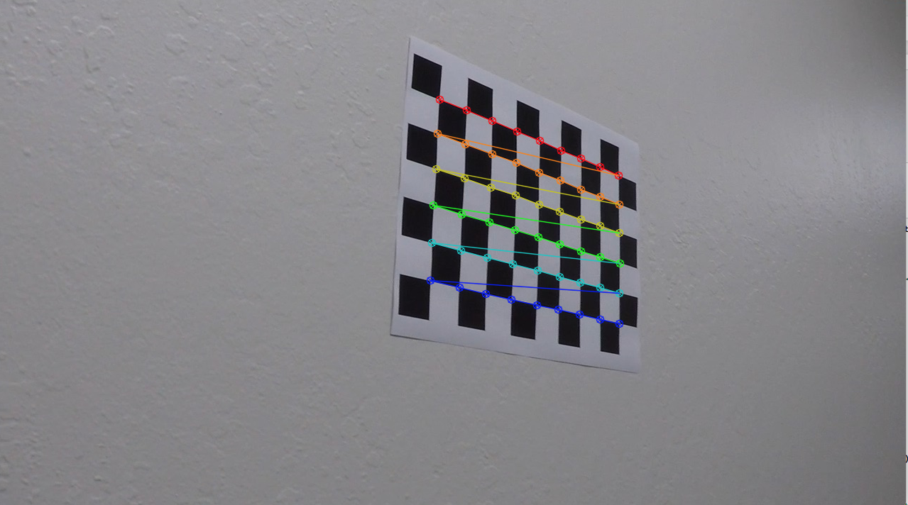       | 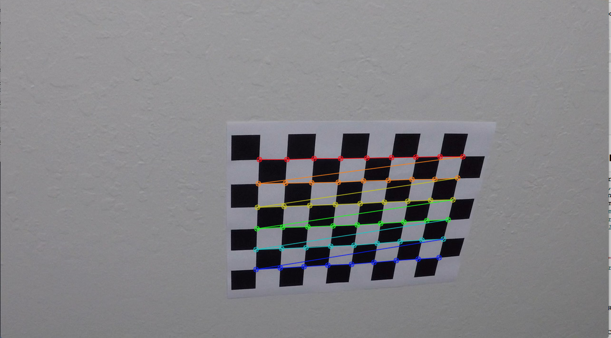   |
| 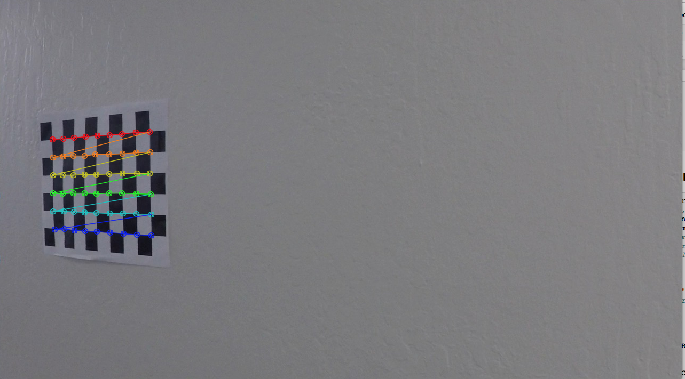     | 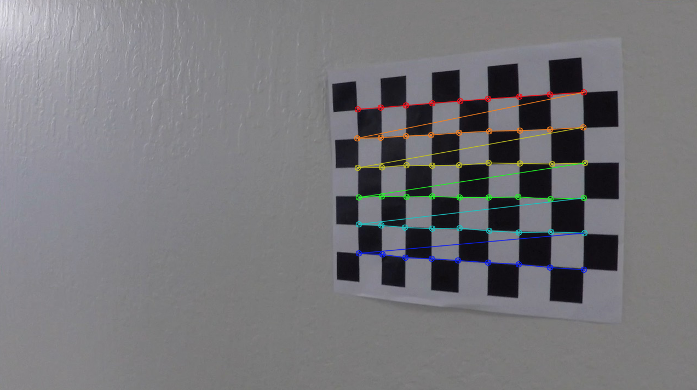|
| 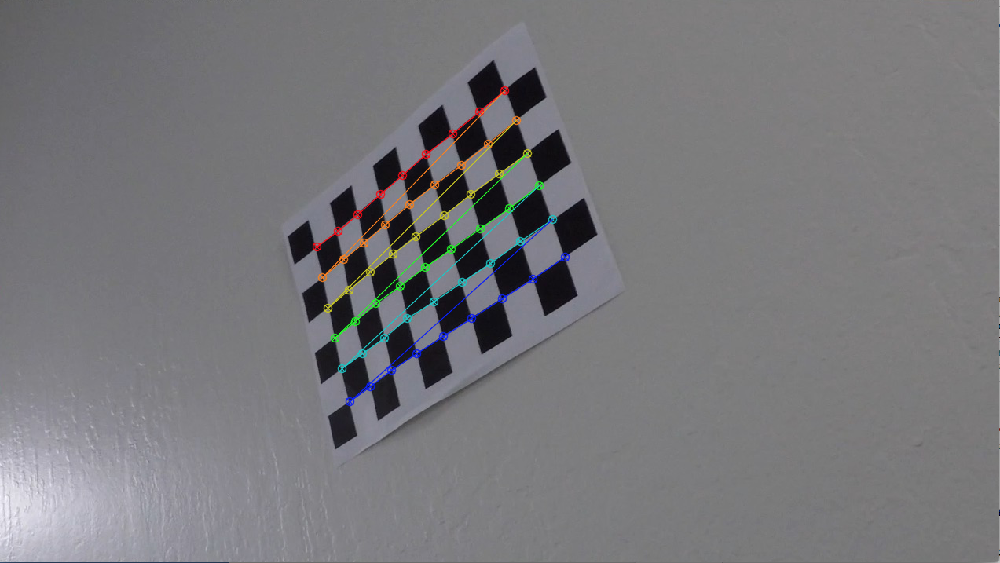    | 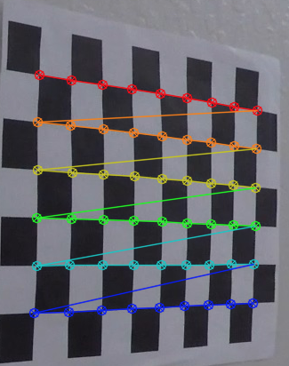 |

- I used all the 20 images to find `objpoints, imgpoints` from the function:

 ```
 def get_chess_image_point_corner_pts(num_row, num_col, glob_path, is_plot=False, is_debug=False):
 ```

### 1.2. Actual calibration

I then used the output `objpoints` and `imgpoints` to compute the camera calibration and distortion coefficients using the `cv2.calibrateCamera()` function. The necessary variables were stored in a dict

```
    cal_dict = {}
    cal_dict['mtx'] = mtx
    cal_dict['dist'] = dist

```

-  I applied this distortion correction to the test image using the function,

```
cv2.undistort(img, cal_dict['mtx'], cal_dict['dist'], None, cal_dict['mtx'])
```
Sample images can be found here :-


- This concludes the first section of Calibrating the camera and findings it undistorted image.


### Pipeline (single images)

#### 1. Provide an example of a distortion-corrected image.

From the above step, I was able to compute the correct camera matrix and distortion coefficients. These coefficients were then used apply distortion correction to the test images provided in `test_images` folder. 
- distortion correction was applied using the following function in my python notebook

```
def test_un_distortion(perspective_image_path):
    pesp_img = cv2.imread(perspective_image_path)
    pesp_img_rgb = cv2.cvtColor(pesp_img, cv2.COLOR_BGR2RGB)

    img_un_dist_rgb = un_distort_image(pesp_img_rgb, cal_dict)

    plot_two_images(pesp_img_rgb, img_un_dist_rgb, plot_diff=True)
```
- This functions reads an image from a local path, converts the image to `RGB`, un distorts it using the coefficients.
- For, helpful debugging, I plotted the diff of the image too. The results are as below:-


#### 2. Describe how (and identify where in your code) you used color transforms, gradients or other methods to create a thresholded binary image.  Provide an example of a binary image result.

All code for this this part is in `Section #4` and `Section #5` of the notebook

I applied image gradients and color transfor in section 4 and 5 of the python notebook. Some details of these sections are mentioned below:

### 2.1 Apply image gradients 
- In this section, I basically implemented 3 different functions related to image transform. The function definitions of each functio is as follows:

```
# Define a function to return the magnitude of the gradient
# for a given sobel kernel size and threshold values
def magnitute_thresh(img, sobel_kernel=3, mag_thresh=(0, 255)):
```

```
# Define a function that takes an image, gradient orientation,
# and threshold min / max values.
def abs_sobel_thresh(img, sobel_kernel=3, orient='x', thresh_min=0, thresh_max=255):
```

```
Define a function to threshold an image on directon for a given range and Sobel kernel
def direction_threshold(img, sobel_kernel=3, dir_thresh=(0, np.pi/2)):

```

The output from these function can be applied in many ways, but I decided to only implement one. In the implementation, I `and` the output from gradx and grady and also `and` the output from direction and mag gradients. These ouputs were then `ORed`

```
def factory_combine_gradients_mag_direction (grad_x, grad_y, mag_thres, dir_thres, mode=1, is_plot=False):
    combined_binary = np.zeros_like(dir_thres)
    if mode == 1:
        return combine_and_x_y_or_and_mag_dir(grad_x, grad_y, mag_thres, dir_thres, is_plot=is_plot)
    raise Exception("Invalid mode:" + str(mode))
    
```
The output from each of these functions can be seen here

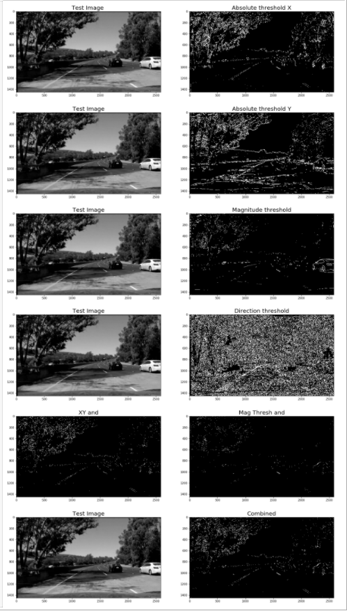


### 2.2 Apply HLS Color spaces 
- Then I looked into how the images looked into `HLS` and `RGB` color space. 
- After doing visual inspection,  I applied gray scale thresholding on `R`, `H`m  `L` and `S` channel. 
- Finally, I settled with `H` channel only  

|   HLS RGB images   		|     	        H,S,R thresholding			| 
|:---------------------:|:---------------------------------------------:| 
| 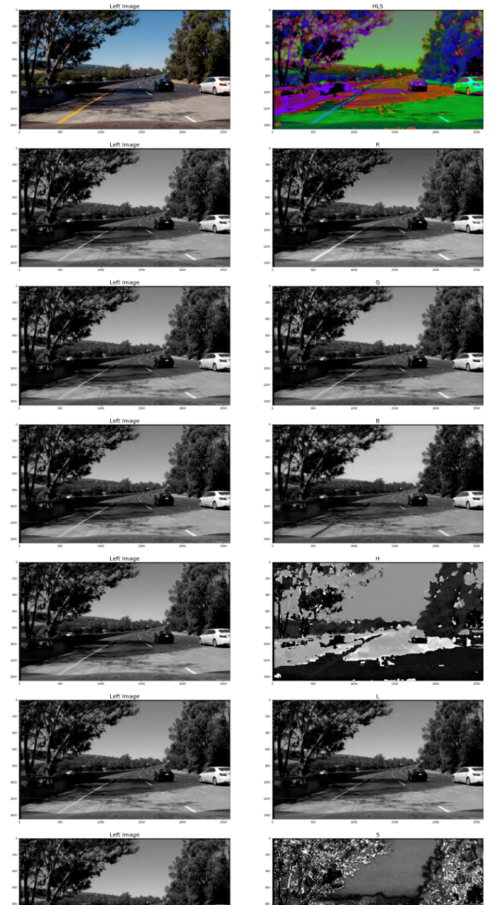     |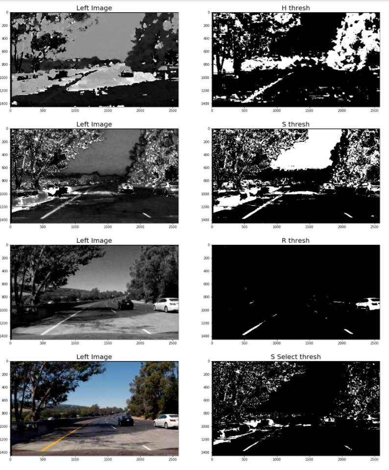   |


### 2.3 Combine Color threshold and gradient threshold
- Finally, in section 4.3. I combined the results from above two sections to produce a single image. 
- After various attemps, I only picked `grad x` thresholdings and `S` channel thresholing from HLS channel. In future work, I will try to combine all the channels for better image detection. But, for now, this worked fine. 
 - This is implemented in `# 4.2 Combine Color threshold and gradient threshold`
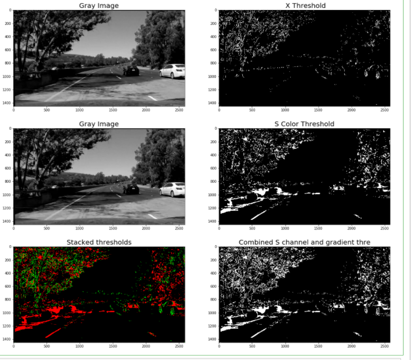

The above functions are implemented in a form of pipeline:

```
# Edit this function to create your own pipeline.
def pipeline(img_BGR, s_thresh=(170, 255), sx_thresh=(20, 100), is_plot=False, add_debug_image=False):
    
```


### Final binary image
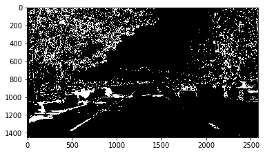

#### 3. Describe how (and identify where in your code) you performed a perspective transform and provide an example of a transformed image.

- The code for perspective transform is in the section `# 3. Step to perform Perspective Transform`
- To apply perspective transform we need pair of 4 points. These points are of an trapezoid in the original image and rectangle points where we would like to transform the image. 

The function definition is:

```
def get_perspective_transform(src, dest, undist_image):
    img_size = (undist_image.shape[1], undist_image.shape[0])
    M = cv2.getPerspectiveTransform(src, dest)
    warped = cv2.warpPerspective(undist_image, M, img_size, flags=cv2.INTER_LINEAR)
    M_INV = cv2.getPerspectiveTransform(dest, src)
    un_warped = cv2.warpPerspective(warped, M_INV, img_size, flags=cv2.INTER_LINEAR)
    
    return M, M_INV, warped, un_warped
```

- I picked the following points

```python
src_pnts = np.float32([[585, 450], [203, 720], [1127, 720], [695, 450]])
dst_pnts = np.float32([[320, 0], [320, 720], [960,720], [960, 0]])
```

This resulted in the following source and destination points:

| Source        | Destination   | 
|:-------------:|:-------------:| 
| 585, 450      | 320, 0        | 
| 203, 720      | 320, 720      |
| 1127, 720     | 960, 720      |
| 695, 450      | 960, 0        |

- Using the `src` and `dst` points , `get_perspective_transform` gave me both the wrapped and unwrapped image.
I verified that my perspective transform was working as expected by drawing the `src` and `dst` points onto a test image and its warped counterpart to verify that the lines appear parallel in the warped image.
- The source points are joined with drawline function from Open CV.
- I also plotted the inverse of the wrap image, to understand how the unwrapped image looks.

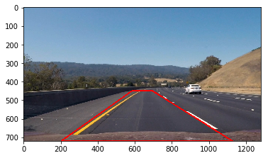


## Pipleine of undistortion, thresholding and prespetive transform. 
- Finally, I combined the output from all of the sections above to get the final image. This image will be used to calculate the radius of curvature and fitting of polynomial of the lane detection.

- The output for a single image looked something like this:-

|  Test image 2 pipeline  		|     	          Test image 5 pipeline			| 
|:---------------------:|:---------------------------------------------:| 
| 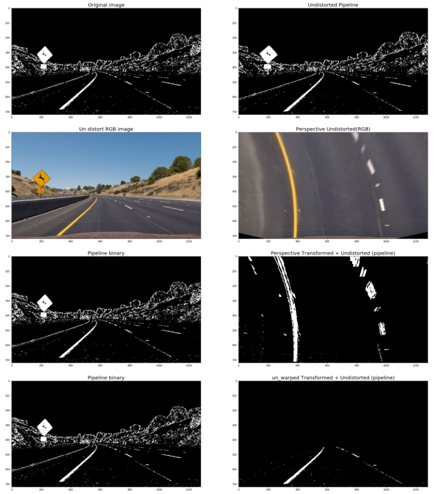     |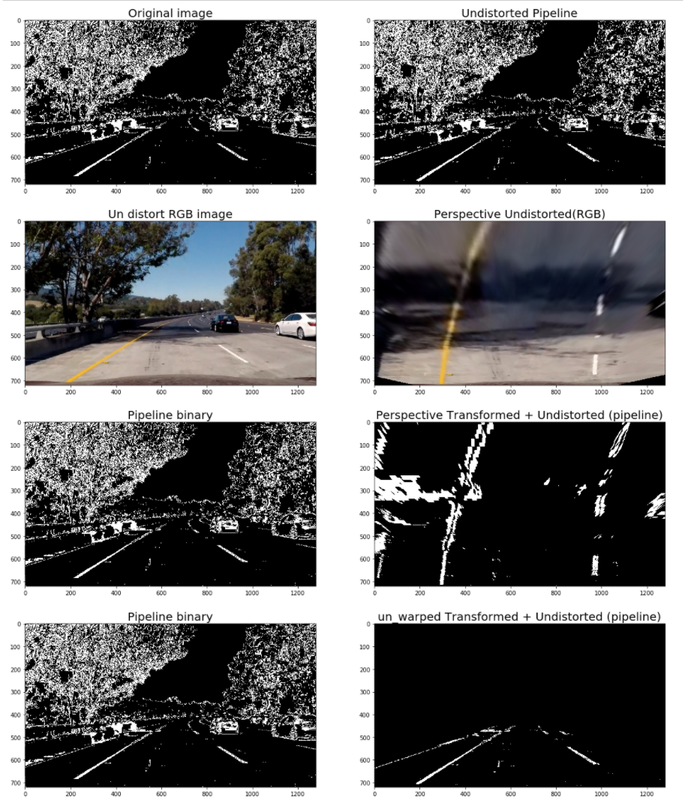   |


#### 4. Describe how (and identify where in your code) you identified lane-line pixels and fit their positions with a polynomial?

Then I did some other stuff and fit my lane lines with a 2nd order polynomial kinda like this:

![alt text][image5]

#### 5. Describe how (and identify where in your code) you calculated the radius of curvature of the lane and the position of the vehicle with respect to center.

I did this in lines # through # in my code in `my_other_file.py`

#### 6. Provide an example image of your result plotted back down onto the road such that the lane area is identified clearly.

I implemented this step in lines # through # in my code in `yet_another_file.py` in the function `map_lane()`.  Here is an example of my result on a test image:

![alt text][image6]

---

### Pipeline (video)

#### 1. Provide a link to your final video output.  Your pipeline should perform reasonably well on the entire project video (wobbly lines are ok but no catastrophic failures that would cause the car to drive off the road!).

Here's a [link to my video result](./project_video.mp4)

---

### Discussion

#### 1. Briefly discuss any problems / issues you faced in your implementation of this project.  Where will your pipeline likely fail?  What could you do to make it more robust?

Here I'll talk about the approach I took, what techniques I used, what worked and why, where the pipeline might fail and how I might improve it if I were going to pursue this project further.  


- addtion to HLS and RGB look at other channels
- instead of S and grad x, combined other channels as well